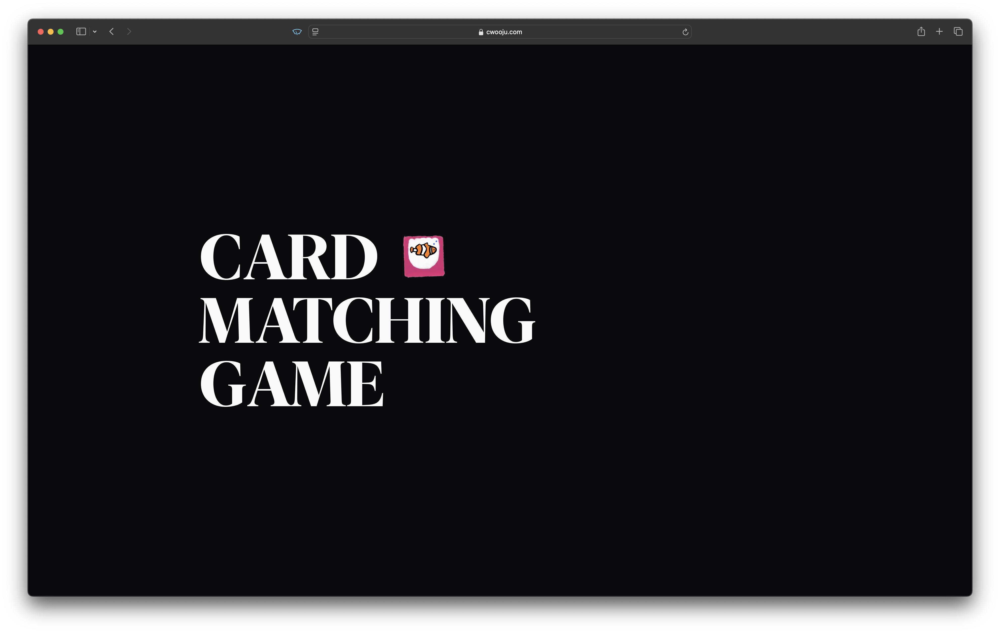
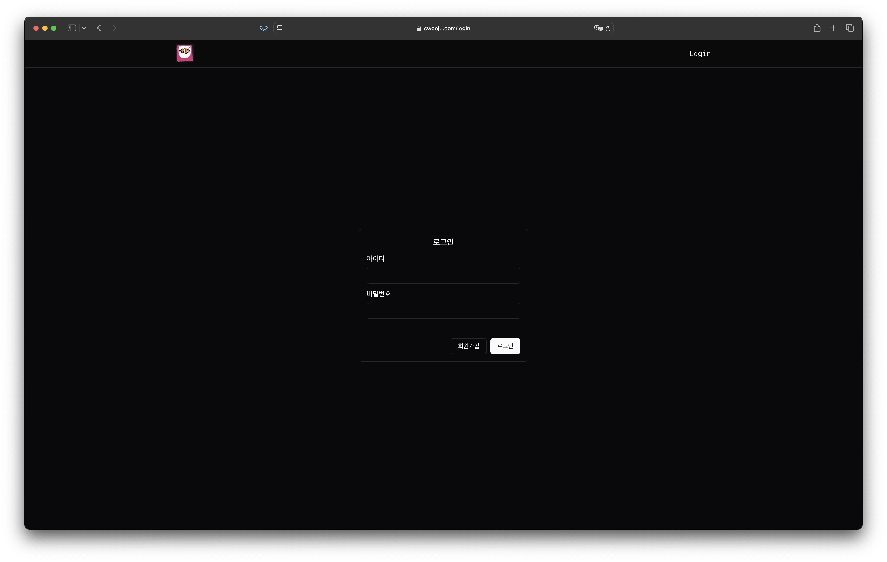
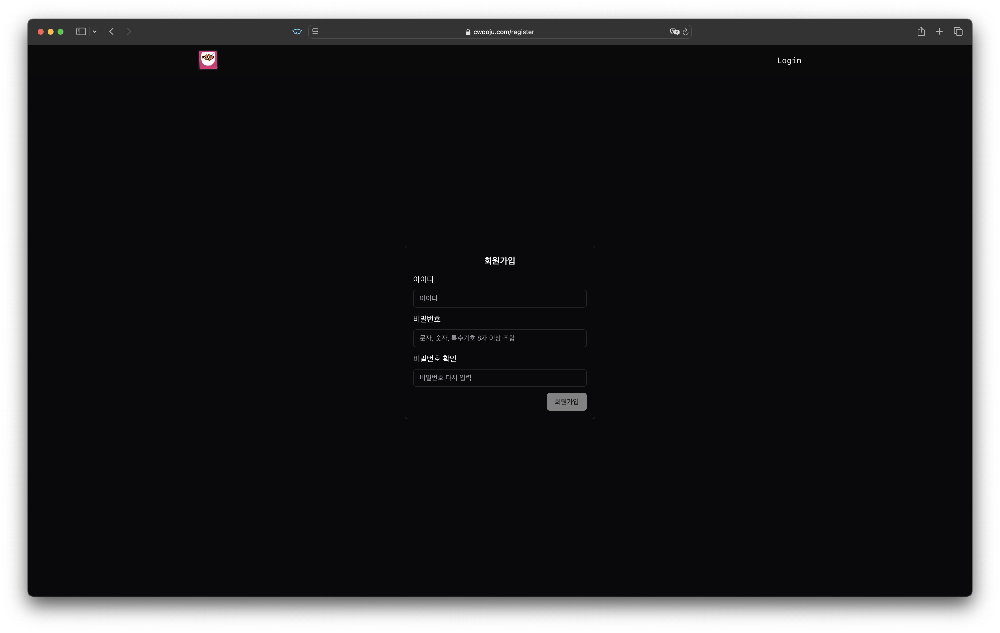
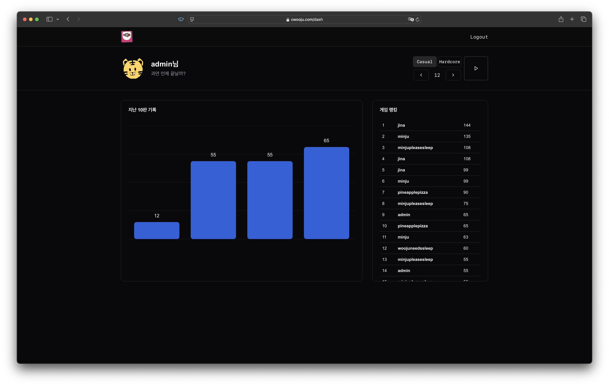
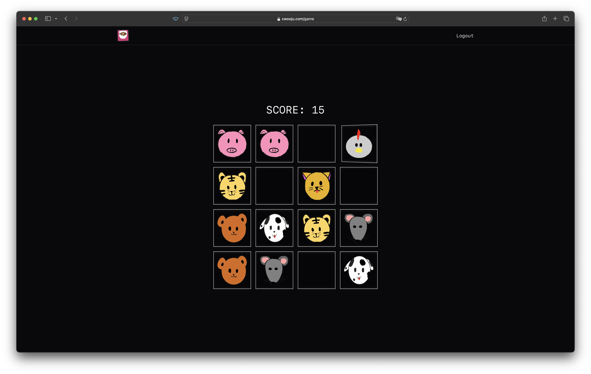

  <h1>web2024-card</h1>  
    
  
  
  

> 2024년 2학기 기웹프로그래밍 - 조별 프로젝트  
> "Made with love and pain by the team"  
>  
> Made by: Nahyun Kim, Chaemin Jin, Wooju Choi, Minju Han 

## Features
- Responsive design
- Hosted via VPS (Amazon AWS)
- Data management w/ MySQL
- Login & register system
- etc.

## Screenshots

  
  
  
  
  

